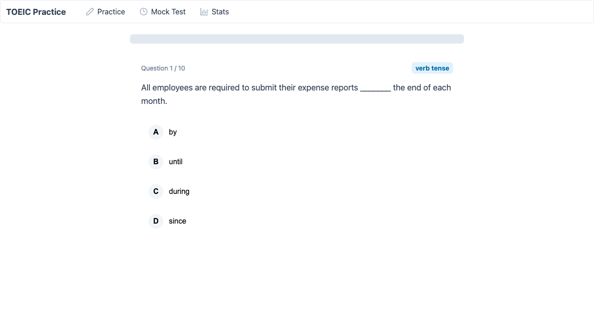
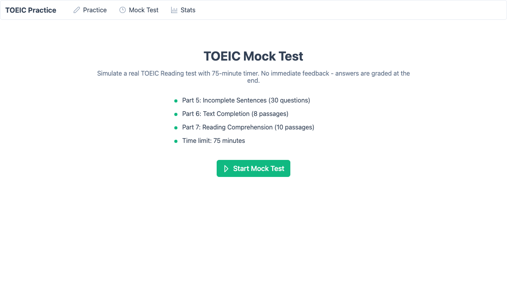
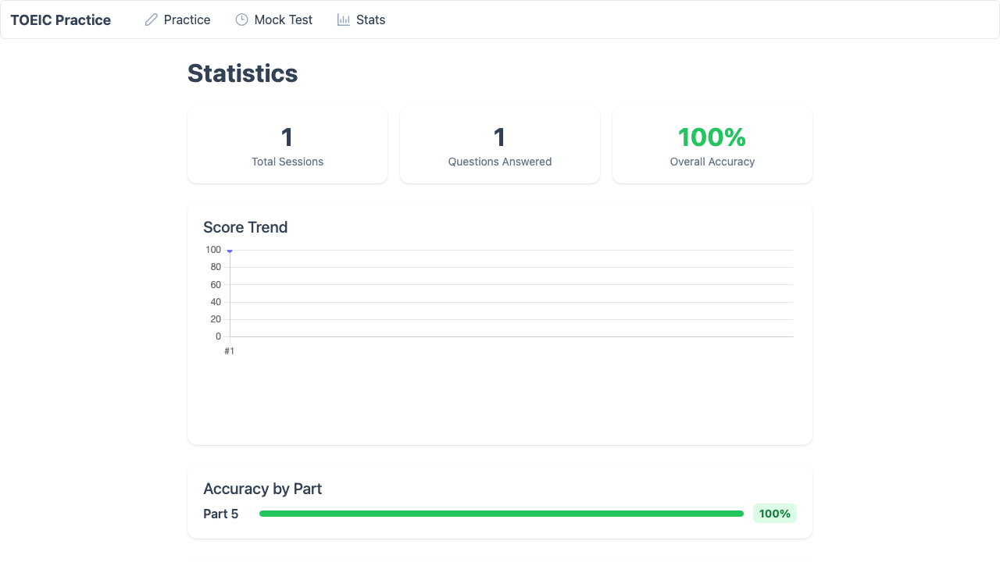

# TOEIC Practice

Standalone TOEIC Reading section drill app. Covers Part 5 (Incomplete Sentences), Part 6 (Text Completion), and Part 7 (Reading Comprehension) with offline question bank, timed mock tests, and score tracking.

Originally extracted from [ai-english-tutor](https://github.com/seikaikyo/ai-english-tutor) -- the tutor keeps voice conversation practice, this app handles the multiple-choice test drilling with a proper quiz UI.

## Screenshots

**Practice mode** -- pick a Part, answer questions with immediate feedback and explanations



**Mock test** -- 75-minute timed simulation across all three Parts, graded at the end with TOEIC score estimation



**Statistics** -- score trends, per-Part accuracy breakdown, weak grammar category detection



## Features

- **Practice mode**: Part 5/6/7 or mixed, choose 5/10/15 questions, instant correct/incorrect feedback with grammar explanations
- **Mock test mode**: 75-minute countdown timer, Part 5/6/7 section tabs with question navigation dots, deferred grading, TOEIC score range estimation (450-495 down to Below 300)
- **Score tracking**: SQLite-backed session history, per-Part accuracy, weak grammar category identification (< 60% on 3+ attempts)
- **124 questions**: 30 Part 5 sentences, 15 Part 6 passages (56 blanks), 15 Part 7 passages (38 comprehension questions)

## Architecture

```
frontend/                        backend/
Vue 3 + TypeScript + PrimeVue    FastAPI + SQLModel + SQLite
              |                           |
              +--- /api proxy (Vite) -----+
                                          |
                                    question_bank/
                                    part5.json, part6.json, part7.json
```

No external AI API needed -- all questions come from a local JSON question bank. The backend handles quiz session management, answer grading, and statistics aggregation.

## Tech stack

| Layer | Stack |
|-------|-------|
| Frontend | Vue 3.5, TypeScript 5.9, Vite 7, PrimeVue 4 (Aura), Chart.js |
| Backend | FastAPI, SQLModel, SQLite, Uvicorn |
| Data | Structured JSON question bank (Part 5/6/7) |

## API

| Endpoint | Method | Description |
|----------|--------|-------------|
| `/api/quiz/questions?part=5&count=10` | GET | Fetch practice questions |
| `/api/quiz/mock-test` | GET | Fetch full mock test (30 + 8 + 10 passages) |
| `/api/quiz/submit` | POST | Submit answers, get score |
| `/api/stats` | GET | Overall accuracy, per-Part breakdown, weak categories |
| `/api/stats/history?limit=20` | GET | Recent session history |
| `/api/status` | GET | Question bank health check |

## Setup

### Backend

```bash
cd backend
python -m venv venv
source venv/bin/activate
pip install -r requirements.txt
uvicorn app.main:app --port 8003
```

### Frontend

```bash
cd frontend
npm install
npm run dev
```

Frontend runs on `http://localhost:5173`, proxies `/api` to backend on port 8003.

## Question bank format

**Part 5** (sentence completion):
```json
{ "id", "sentence", "options": [4], "answer", "explanation", "grammar_category" }
```

**Part 6** (text completion):
```json
{ "id", "passage_type", "passage", "questions": [{ "blank_number", "options", "answer", "explanation" }] }
```

**Part 7** (reading comprehension):
```json
{ "id", "passage_type", "passage", "questions": [{ "question", "options", "answer" }] }
```
